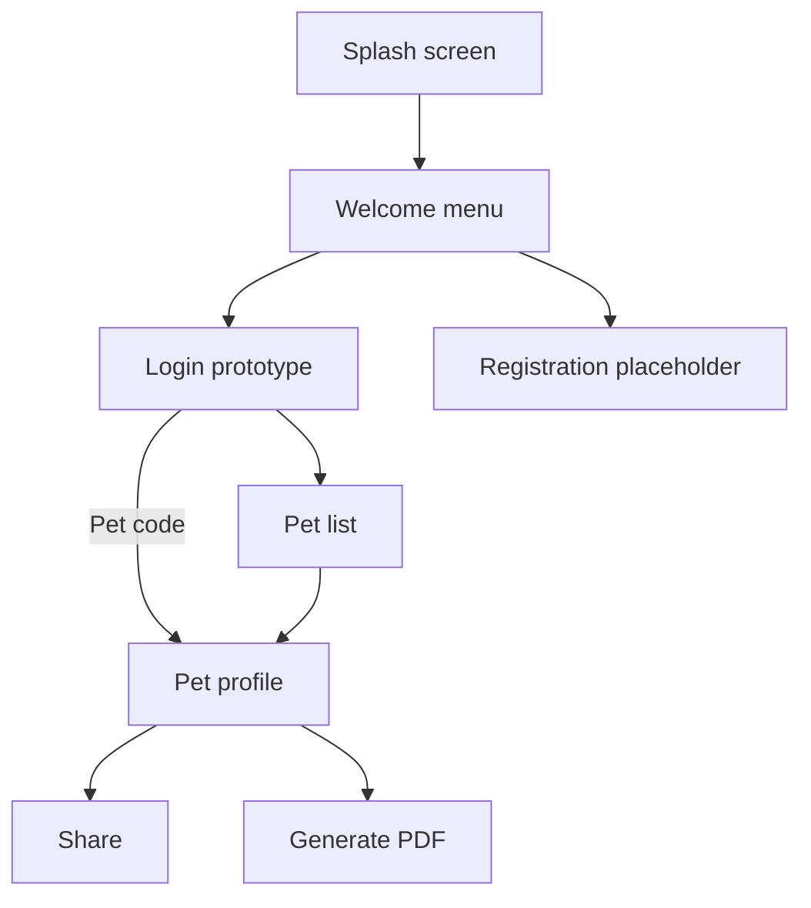
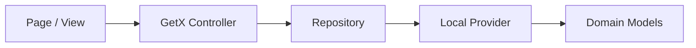

# MyPets

<p align="center">
  
</p>

<p align="center">
  A Flutter application for keeping essential pet information organized, accessible, and easy to share.
</p>

<p align="center">
  
  
  
  
</p>

## Overview

MyPets is a mobile-first Flutter prototype that gives pet owners a central place to view pet profiles, care instructions, and important contacts. A pet can also be found directly by its unique code, providing the foundation for a future QR-enabled lost-pet and shared-care experience.

The current release uses an in-memory local data source. It demonstrates the application flow and architecture without requiring a backend or user account.

## Current Features

- Browse a locally populated list of pets.
- View each pet's identity, physical details, care instructions, and contacts.
- Find a pet by a case-insensitive pet code.
- Share pet-list information through the platform share sheet.
- Generate and open a PDF file on supported mobile platforms.
- Navigate through a modular GetX route and dependency-injection setup.
- Display selected interface labels in English or Spanish based on device locale.
- Run on a modern Dart 3, Flutter, Material 3, and Android toolchain.

> [!IMPORTANT]
> MyPets is under active development. Login, registration, pet creation, remote persistence, and production-ready PDF content are not implemented yet. The current login button is a prototype navigation flow and must not be treated as authentication.

## Application Flow



## Architecture

MyPets follows a feature-first structure with a lightweight provider/repository data layer.



- **Pages** render the interface and forward user actions.
- **Controllers** coordinate presentation state and navigation.
- **Repositories** expose data and device operations to controllers.
- **Providers** supply local pet data and mobile file operations.
- **Bindings** create feature controllers when their routes are opened.
- **Dependency injection** registers application-wide providers and repositories through GetX.

### Project Structure

```text
lib/
├── main.dart
└── app/
    ├── data/
    │   ├── models/
    │   ├── providers/local/
    │   └── repositories/local/
    ├── global_widgets/
    ├── messages/labels/
    ├── modules/
    │   ├── home/
    │   ├── login/
    │   ├── pet/
    │   ├── pet_list/
    │   ├── register/
    │   ├── splash/
    │   └── splash_menu/
    ├── routes/
    └── utils/
```

Additional architecture, workflow, and testing notes are available in [`openwiki/`](openwiki/quickstart.md).

## Technology Stack

| Area | Technology |
| --- | --- |
| UI | Flutter, Material 3, `flutter_screenutil` |
| Language | Dart 3 |
| State, routing, and DI | GetX |
| Sharing | `share_plus` |
| PDF generation | Syncfusion Flutter PDF |
| File access | `path_provider`, `open_file` |
| Platforms | Android, iOS, and Flutter web scaffold |

## Getting Started

### Prerequisites

- Flutter SDK with Dart `>=3.4.0 <4.0.0`
- Android Studio or Visual Studio Code with the Flutter extension
- A configured emulator, simulator, physical device, or supported browser
- For Android builds:
  - Java 17
  - Android SDK 36
  - Android NDK `28.2.13676358`

Confirm that the Flutter toolchain is ready:

```bash
flutter doctor
flutter devices
```

### Installation

```bash
git clone https://github.com/Kolb22/MyPets.git
cd MyPets
flutter pub get
flutter run
```

To select a particular device:

```bash
flutter run -d <device-id>
```

## Demo Data

The prototype ships with three local profiles. Enter any of the following codes on the login screen to open a pet directly:

| Code | Pet | Animal |
| --- | --- | --- |
| `PET-0001` | Yordy | Dog |
| `PET-0002` | Mia | Cat |
| `PET-0003` | Rocky | Dog |

These records live in [`lib/app/data/providers/local/pet_provider.dart`](lib/app/data/providers/local/pet_provider.dart) and are reset whenever the application restarts.

## Quality Checks

Format and analyze the source before submitting a change:

```bash
dart format --output=none --set-exit-if-changed lib test
flutter analyze
flutter test
```

> [!NOTE]
> The repository currently contains Flutter's obsolete counter-template widget test. It does not match the MyPets interface and is expected to fail until it is replaced with application-specific tests.

Recommended coverage areas include:

- Pet-code validation and lookup.
- Repository and provider behavior.
- Loading, empty, and error states.
- Navigation from the list to a selected pet.
- PDF and sharing behavior behind platform-aware abstractions.

## Known Limitations

- Pet data is stored in memory and cannot be created, edited, or deleted.
- Login and registration are not connected to an authentication service.
- The registration and home screens are placeholders.
- Sharing currently uses prototype text instead of a public pet link.
- The generated PDF still contains sample content and is not a complete pet report.
- Mobile file operations are not yet guarded for every supported platform.
- Remote images do not yet provide loading or failure placeholders.
- Android release builds use debug signing and are not suitable for distribution.

## Roadmap

- [ ] Replace the obsolete widget test and establish automated coverage.
- [ ] Implement secure registration, login, logout, and session persistence.
- [ ] Add create, update, and delete workflows for pets.
- [ ] Introduce persistent storage and a remote API.
- [ ] Support image upload with loading and failure states.
- [ ] Generate QR codes and public, privacy-aware pet profiles.
- [ ] Create pet-specific PDF reports.
- [ ] Add tap-to-call and emergency-contact actions.
- [ ] Complete English and Spanish localization.
- [ ] Add CI checks and production signing.

## Contributing

1. Create a focused branch from the latest `main`:

   ```bash
   git checkout main
   git pull origin main
   git checkout -b feature/short-description
   ```

2. Keep changes aligned with the existing page/controller/binding structure.
3. Add or update tests for changed behavior.
4. Run formatting, analysis, and tests locally.
5. Open a pull request that explains the problem, approach, verification, and any known limitations.

See [`AGENTS.md`](AGENTS.md) for repository-specific development conventions.

## Author

**Kevin Leon**

- [Portfolio](https://kevinleon.dev/)
- [LinkedIn](https://www.linkedin.com/in/kevinoleonberrios/)
- [GitHub](https://github.com/Kolb22)

---

MyPets is currently a portfolio and product-development prototype. It is not intended to store or expose real personal, medical, or emergency information in production.
